# Anti Corona Android Client

AntiCorona is android app to monitoring COVID-19 data in the world especially in Indonesia, this app can also provide the latest information and advice about covid-19.

## Features
* Covid-19 data cases in world especially in Indonesia
* Covid-19 news
* Change Theme (Default and Ocean)
* Change Language (Indonesian and English)
* Covid-19 FAQ
* Daily Notification

## Download Apps
This App has 2 versions developed, Stable version and Beta version, different between two is below:

Stable Version (Some device not supported in-app WebView)
* Open news via browser
* When notification clicked, open browser

Beta Version (Supported all device with Android 5.0 or above)
* Open news via in-app WebView
* When notification clicked, open in-app WebView

Download stable version [](https://drive.google.com/file/d/1Zy5EIN-n-ymIj49e5Oge7g4peJUN6YZO/view)<br>
Download Beta version [](https://drive.google.com/file/d/1l2J1xz2Wd4fOOx0xxQ0PJpMYYP1zCDOS/view)

## Screenshot
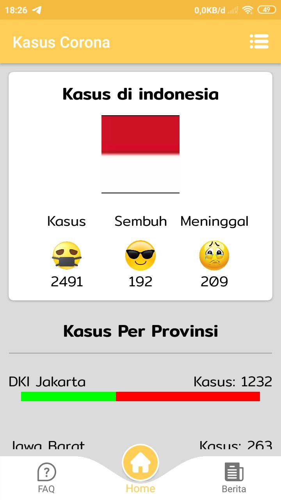 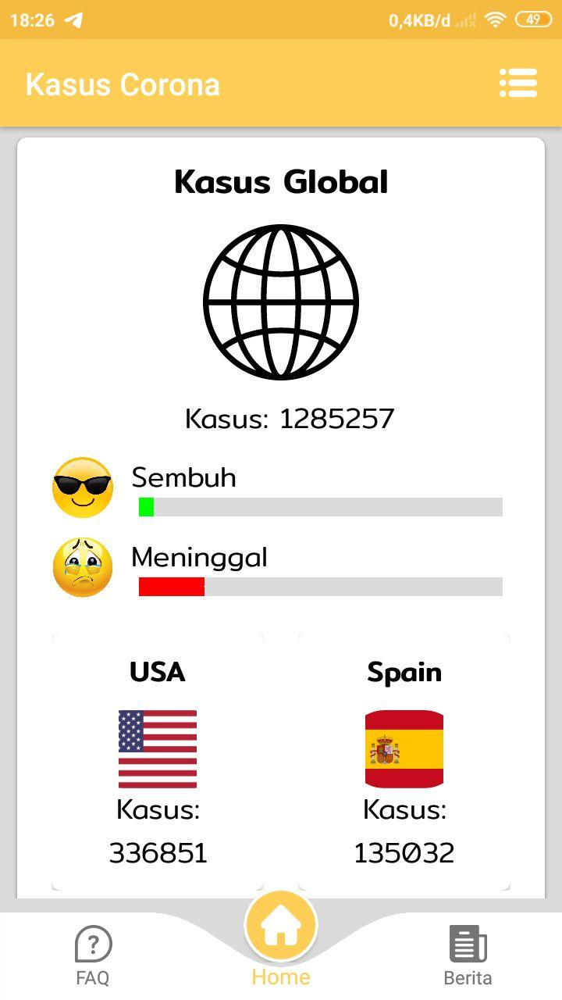 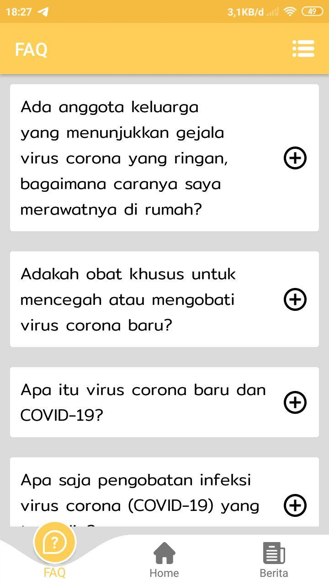 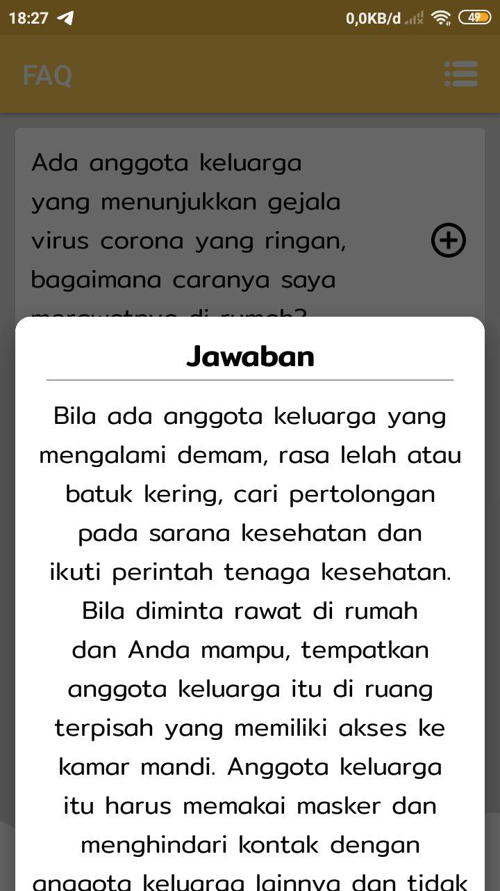 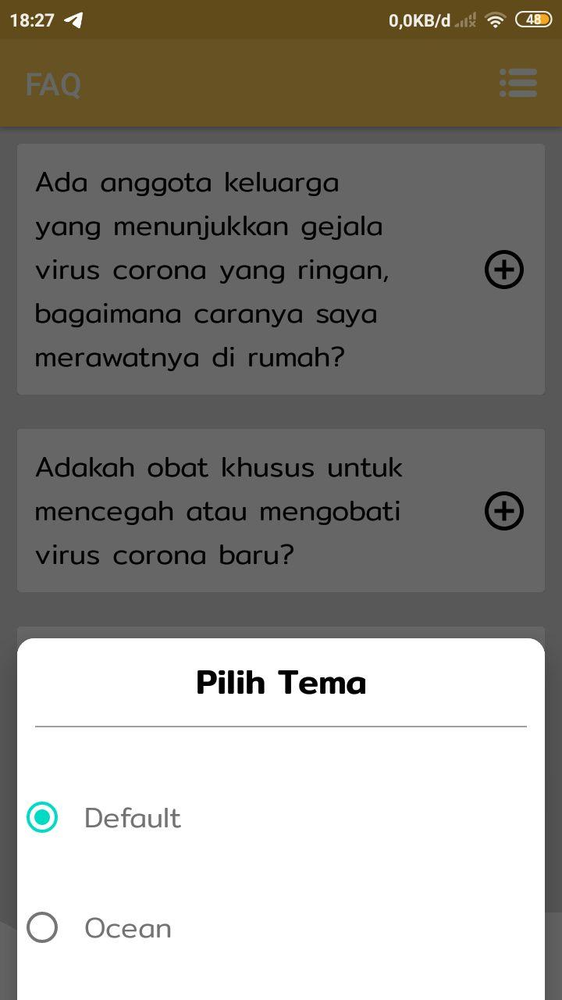 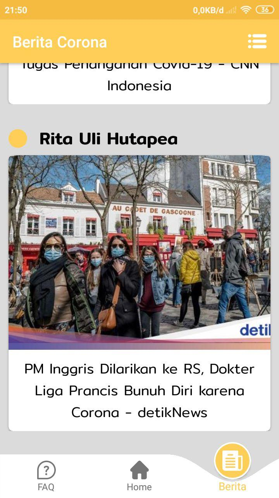 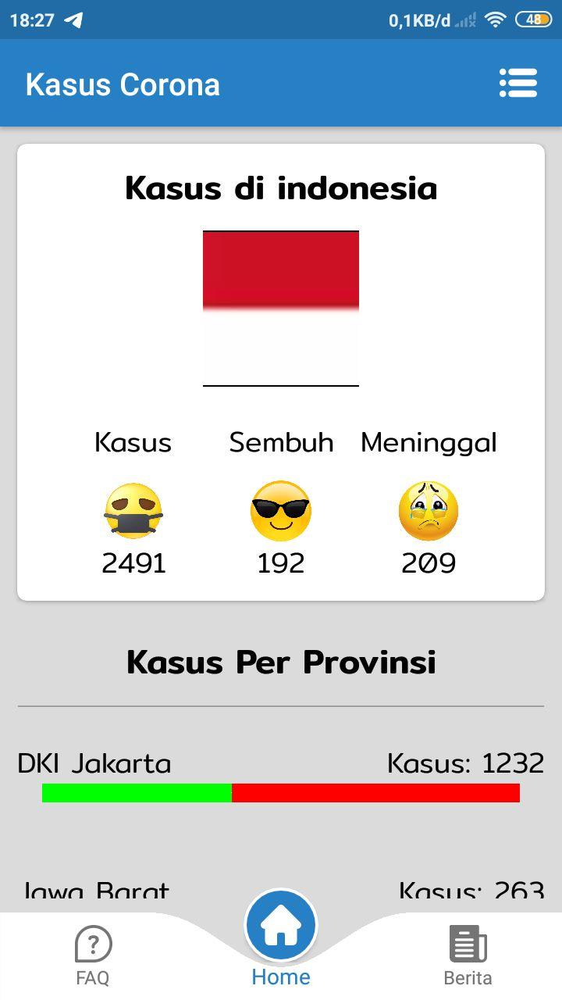 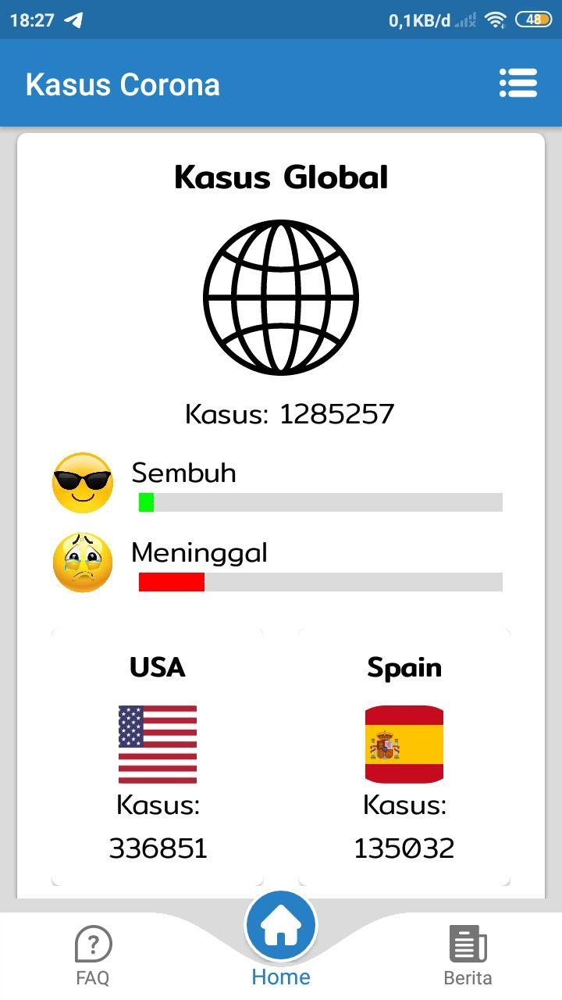 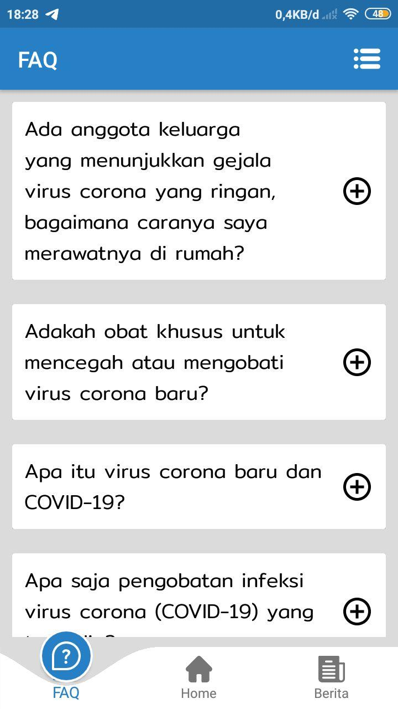 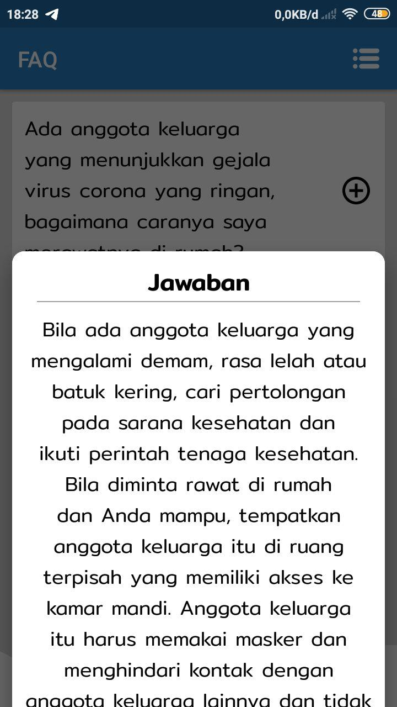 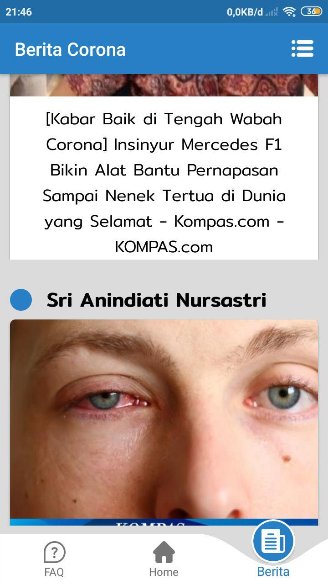

## Demo Application
[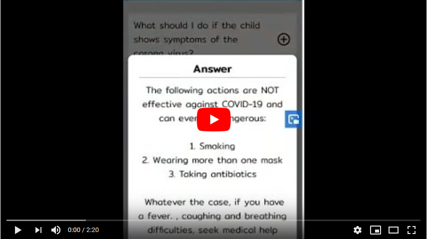](https://youtu.be/LA7u5Zhux2A)

## Assets and data sources
* [flaticon](https://flaticon.com)
* [svg2vector](https://svg2vector.com)
* [inloop](https://inloop.github.io)
* [cleanpng](https://cleanpng.com)
* [Google Fonts](https://fonts.google.com)
* [hub png](https://hubpng.com)
* [AntiCorona API](https://github.com/nothing2512/AntiCoronaAPI)

## Contributing
Pull requests are welcome. For major changes, please open an issue first to discuss what you would like to change.

Please make sure to update tests as appropriate.

## License
[Apache V2.0](https://www.apache.org/licenses/LICENSE-2.0)
```$xslt
Copyright 2020 Nothing

Licensed under the Apache License, Version 2.0 (the "License");
you may not use this file except in compliance with the License.
You may obtain a copy of the License at

    http://www.apache.org/licenses/LICENSE-2.0

Unless required by applicable law or agreed to in writing, software
distributed under the License is distributed on an "AS IS" BASIS,
WITHOUT WARRANTIES OR CONDITIONS OF ANY KIND, either express or implied.
See the License for the specific language governing permissions and
limitations under the License.
```